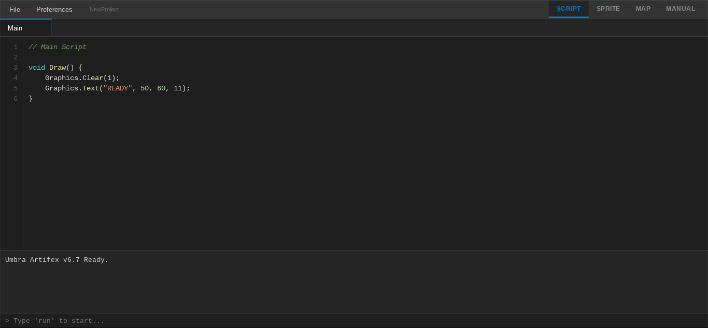

# Umbra Artifex 🌑

> **"My attempt at building a fantasy console"**

Umbra Artifex is a lightweight, web-based fantasy console (inspired by PICO-8 and TIC-80) contained entirely within a single HTML file. It features a complete development environment including a code editor, sprite editor, and map editor, all running without any external dependencies or libraries.



## Features

Everything is built from the ground up using vanilla JavaScript, HTML, and CSS.

* **All-in-One Architecture:** The IDE and the Runtime are in one file.
* **Code Editor:**
    * Custom Syntax Highlighting (C-style syntax that transpiles to JS).
    * Auto-indentation and bracket auto-closing.
    * Multi-tab support for organizing scripts.
* **Sprite Editor:**
    * 128x128 pixel sprite sheets.
    * Drawing tools including Pencil and **Flood Fill**.
    * Collision Flag management system.
* **Map Editor:** Tile-based level design.
* **Virtual Machine:**
    * 128x128 Virtual Screen resolution.
    * Synthesized Audio API (Oscillators).
    * **Export to HTML:** Turn your game into a single standalone file to share with friends.

## 🛠️ How to Use

1.  **Download:** simply download the `index.html` file.
2.  **Run:** Open it in any modern web browser (Chrome, Firefox, Edge).
3.  **Code:** Write your game logic in the Code tab.
4.  **Run Game:** Type `run` in the terminal or click the Run button.

## The Language

The engine uses a C-like syntax that is transpiled to JavaScript at runtime. You can use types like `void`, `int`, `float`, and `string`.

**Example:**
```us
// Define variables
float x = 60;
float y = 60;

// Runs once at start
void Init() {
    Trace("Game Started");
}

// Runs 60 times per second
void Update() {
    if (Input.Key("ArrowRight")) x = x + 1;
    if (Input.Key("ArrowLeft")) x = x - 1;
}

// Handles rendering
void Draw() {
    Graphics.Clear(1); 
    Graphics.Sprite(0, x, y);
}
